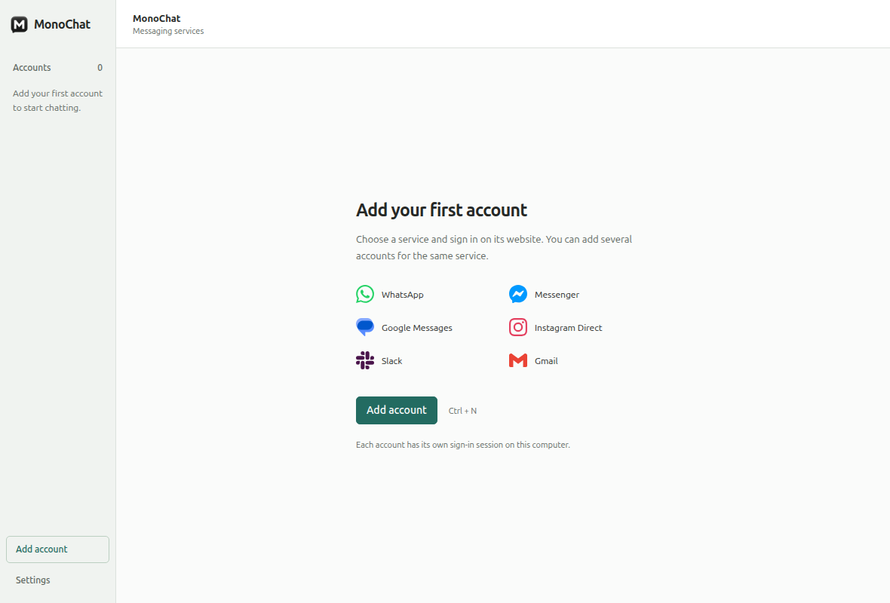
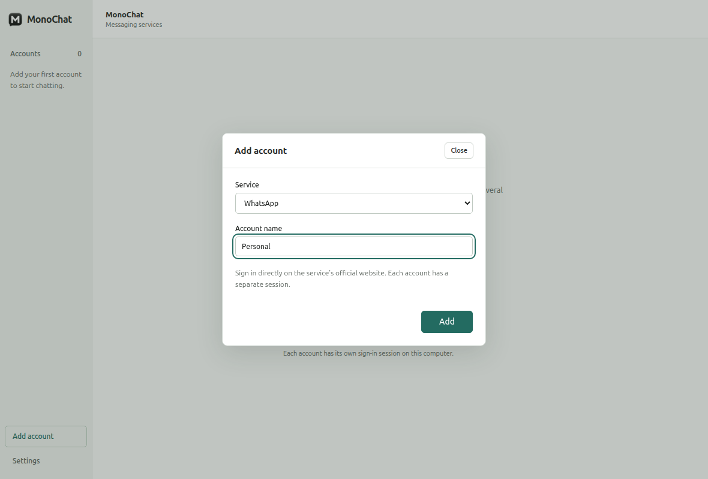
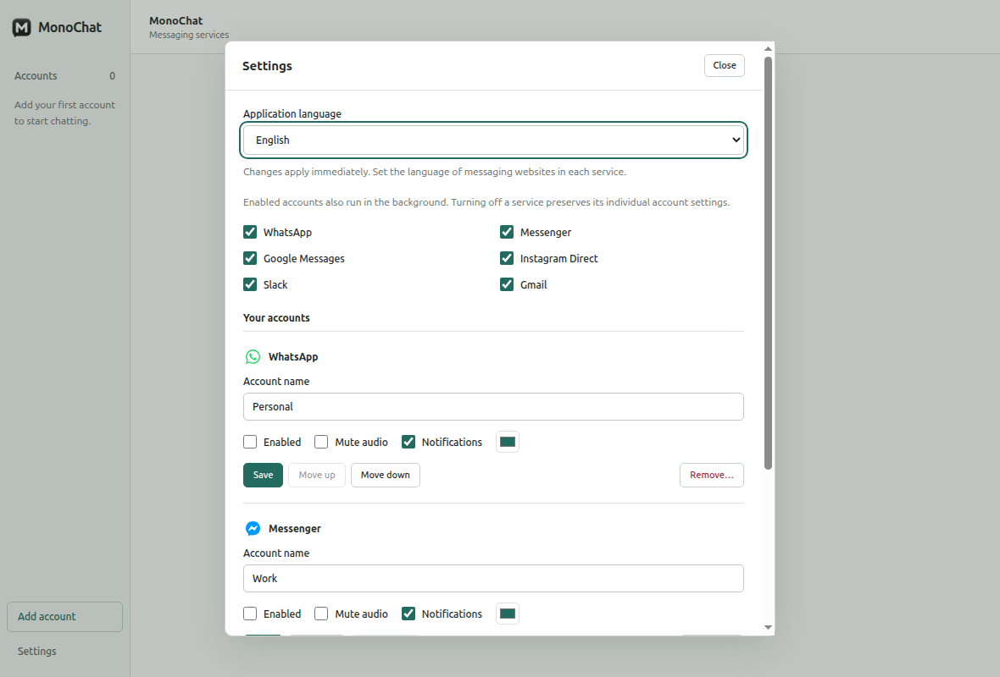

# MonoChat

[Polski](#polski) · [English](#english)

## Polski

MonoChat to niezależna aplikacja desktopowa dla Linux, która łączy wiele kont WhatsApp, Messenger, Wiadomości Google, Instagram Direct, Slack i Gmail w jednym oknie. Korzysta z oficjalnych stron usług. Jest napisana w TypeScript i Electron, bez frameworka frontendowego i własnego serwera.

**Wersja 0.1.0.** Dostępne formaty pakietów: AppImage i deb.

- Autor i opiekun: **Piotr Grono**.
- Witryna projektu: [strony.olsztyn.pl/monochat](https://strony.olsztyn.pl/monochat).
- Kod źródłowy: [pgrono/monochat](https://github.com/pgrono/monochat).
- Licencja własnego kodu i grafiki MonoChat: [MIT](LICENSE).

### Funkcje

- Wiele niezależnych kont tej samej usługi, każde z własnym UUID i trwałą partycją przeglądarki.
- Dodawanie, nazywanie, zmiana kolejności, wyłączanie i usuwanie kont; osobne ustawienia dźwięku i powiadomień.
- Włączanie i wyłączanie całej usługi z zachowaniem ustawień jej kont.
- Przełączanie aktywnych kont bez przeładowania stron. Włączone konta działają w tle.
- Interfejs angielski, polski, niemiecki, francuski, hiszpański i włoski.
- Automatyczny język systemu lub ręczny wybór w ustawieniach, działający od razu i zapamiętywany po restarcie.
- Osadzone strony odseparowane od lokalnego interfejsu, bez dostępu do Node.js ani API aplikacji.
- Atomowy zapis konfiguracji, kopia ostatniej poprawnej konfiguracji i trwały rejestr usuwania danych.
- Zapamiętanie okna, ochrona przed drugą kopią, opcjonalne zamykanie do zasobnika i jawne zakończenie programu.
- Pakiety AppImage i deb dla Linux.

### Instalacja i uruchomienie

Podstawowa platforma: **Linux x86_64**. Lokalne paczki znajdują się w `release/`:

- `MonoChat-0.1.0.AppImage` — uruchom jako zwykły użytkownik; system może wymagać zgodności z FUSE 2.
- `monochat_0.1.0_amd64.deb` — pakiet dla Ubuntu/Debian.

Uruchamiaj MonoChat jako zwykły użytkownik, z włączonym sandboxem Chromium. Więcej informacji znajdziesz w [instrukcji po polsku](docs/INSTRUKCJA-PL.md).

### Korzystanie

Wybierz **Dodaj konto**, usługę oraz nazwę konta. Zaloguj się bezpośrednio na oficjalnej stronie. Możesz powtórzyć to dla kolejnych kont tej samej usługi. Nie wpisuj haseł do usług w formularzach ustawień MonoChat.

W **Ustawieniach** znajdziesz również wyłączone konta, przełączniki usług, dźwięku i powiadomień, kolejność oraz usuwanie. Zmiany pojedynczego konta zatwierdzaj przyciskiem **Zapisz**. Usunięcie dotyczy tylko lokalnej instancji i jej sesji, nie konta w usłudze. Restart kończy usunięcie katalogu partycji. Błąd czyszczenia pozostaje widoczny i umożliwia ponowienie.

**Ustawienia → Język aplikacji** pozwala wybrać Automatycznie, English, Polski, Deutsch, Français, Español lub Italiano. Tryb automatyczny wybiera pierwszy obsługiwany język systemu, a przy braku takiego języka — angielski. Zmiana nie przeładowuje komunikatorów. Język stron usług ustawiasz w samych usługach.

Skróty: **Ctrl+N** — dodawanie, **Ctrl+,** — ustawienia, **Ctrl+R** — przeładowanie bieżącej usługi, **Ctrl+Q** — zakończenie. **Esc** zamyka lokalny dialog. Kolejność można zmieniać przeciąganiem oraz przyciskami **Wyżej / Niżej**.

### Ograniczenia i prywatność

Logowanie, rozmowy i załączniki obsługują oficjalne strony. Google Messages wymaga telefonu/konta zgodnie z zasadami usługi; MonoChat nie wysyła SMS samodzielnie. Instagram otwiera Direct, ale pozostała nawigacja strony nie jest usuwana. Nie ma licznika nieprzeczytanych wiadomości, ponieważ nie potwierdzono wiarygodnej integracji.

Powiadomienia i dźwięk mają osobne przełączniki. Powiadomienia korzystają z mechanizmów danej usługi i pulpitu Linux. Wyłączenie konta zatrzymuje jego stronę i usuwa rejestrację service workerów, zachowując dane logowania.

MonoChat nie dodaje telemetrii i nie wymaga własnego konta użytkownika. [Prywatność](PRIVACY.md), [bezpieczeństwo i zgłaszanie podatności](SECURITY.md), [zasady współpracy](CONTRIBUTING.md).

---

## English

An independent Linux desktop workspace for multiple WhatsApp, Messenger, Google Messages, Instagram Direct, Slack and Gmail accounts. Written in TypeScript with Electron WebContentsView, without a frontend framework or application server.

**Version 0.1.0.** Package formats: AppImage and deb.

- Author and maintainer: **Piotr Grono**.
- Project website: [strony.olsztyn.pl/monochat](https://strony.olsztyn.pl/monochat).
- Source code: [pgrono/monochat](https://github.com/pgrono/monochat).
- License for original MonoChat code and artwork: [MIT](LICENSE).

### Features

- Separate immutable UUID and persistent Electron partition for every account.
- English, Polish, German, French, Spanish and Italian UI, selected automatically from the system language or manually in Settings.
- Account sidebar, add/rename, enable/disable, independent audio and notification controls, drag ordering and keyboard ordering buttons.
- Global service pause that retains individual account flags.
- Kept-alive enabled views; switching does not recreate or load them again.
- Local dialogs hide remote views. Startup, loading, network errors, retry and renderer crashes have UI states.
- Atomic configuration, backup recovery and a durable deletion journal. Account removal confirms its name and finishes directory removal on restart.
- Sandboxed remote pages without preload or application IPC. Validated local IPC, navigation rules, same-session login popups and origin-scoped permission prompts.
- Native file upload dialogs and downloads with save dialogs; downloads never auto-execute.
- Window geometry, single-instance lock, optional close-to-tray with a live Linux tray-host check, explicit quit.
- AppImage and deb packages for Linux.

### Installation

Platform: **Linux x86_64**. Local packages are available in `release/`:

- `MonoChat-0.1.0.AppImage` — run as a regular user; your system may require FUSE 2 compatibility.
- `monochat_0.1.0_amd64.deb` — package for Ubuntu/Debian.

Run MonoChat as a regular user with Chromium sandboxing enabled.

### Usage

**Settings → Application language** offers Automatic (the default) and six languages, listed by their native names. Changes apply immediately and persist across restarts. Automatic uses the first supported system language, falling back to English. Existing configurations migrate to Automatic without changing accounts or sessions. Service websites keep their own language settings.

Choose **Add account**, a service and a name. Authenticate in the official page. Repeat for additional accounts, including multiple accounts of the same service. Do not enter service passwords into any MonoChat settings field.

Use **Settings** for disabled accounts, service pause, audio, notifications, order and removal. Save individual account edits with **Save**. Removing an account affects this local installation only; the service account remains. Restart completes the queued partition-directory deletion. A failure stays visible and can be retried.

Shortcuts: Ctrl+N adds an account, Ctrl+, opens settings, Ctrl+R returns the selected service to its start URL, Ctrl+Q exits. Esc closes a local dialog. Reordering is also available through **Move up / Move down**.

### Integration boundaries

Official pages own authentication, message data and attachment UI. Google Messages depends on the user's phone/account and is not an independent SMS sender. Instagram starts at Direct and redirects the post-login root back to Direct; the remaining official navigation is not removed. There is no unread counter because no reliable integration has been verified.

Notification permission and audio are controlled separately. Notifications use the mechanisms provided by each service and the Linux desktop. Service workers are unregistered on disable to stop background work; cookies and site storage are retained.

MonoChat adds no telemetry and requires no separate MonoChat account. [Privacy](PRIVACY.md) · [Security](SECURITY.md) · [Contributing](CONTRIBUTING.md).
